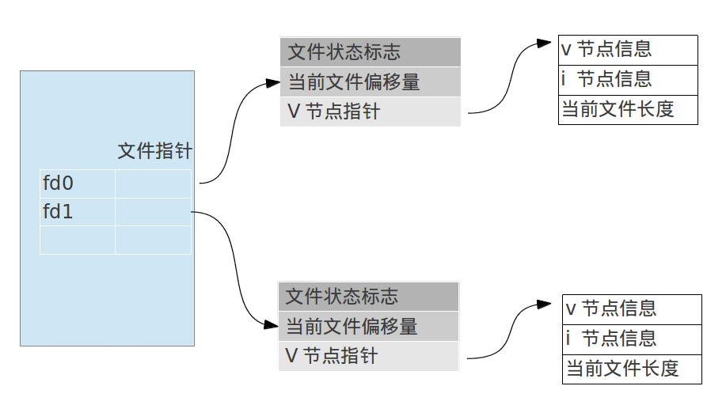
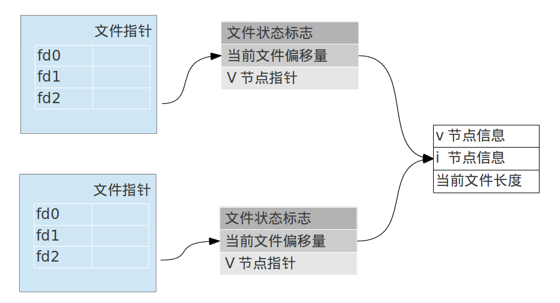

### 文件描述符
Unix系统中大多数文件I/O只需用到五个函数：`open`,`read`,`write`,`lseek`,`close`.

当程序打开，创建文件时，系统内核向进程返回一个文件描述符（非负整数）。对于标准的输入，标准输出，标准错误分别对应数字：0，1，2. 在头文件`<unistd.h>`中定义

### open 函数
```c
#include <fcntl.h>
int open(const char * pathname, int oflg, mode_t mode);
```

### create 函数
```c
#include <fctnl.h>
int create(const char * pathname, mode_t mode);
```
此函数等于：
```c
open(pathname, O_WRONLY | O_CREAT | O_TRUNC, mode);
```
1. `O_WRONLY`: 只写打开
1. `O_CREAT`: 如果文件不存在，则创建它
1. `O_TRUNC`: 如果文件存在，则将其长度截为0

### close函数
```c
#include <unistd.h>
int close(int fileds);
```

### lseek函数
**每个打开的文件都有一个与其关联的当前文件偏移量(current file offset)**

```c
#include <unistd.h>
off_t lseek(int fileds, off_t offset, int whence);
```
`whence`有如下三种值:

1. `SEEK_SET` 从0(文件开始)偏移
2. `SEEK_CUR` 从当前值开始偏移
3. `SEEK_END` 从文件末尾开始偏移

**注意:** offset值可以为负

对于一个管道(Pipe), FIFO， 网络套接字(Socket)，调用lseek会返回-1。并将errno设置为`ESPIPE`

lseek函数可以传入的偏移值大于文件末尾的位置值，如果当前的偏移值大于末尾位置，并且此时继续写入数据的话，从末尾的位置到新写入的数据位置全部是`空位`，不用占据存储空间。下面看个写入空洞数据的程序：
```c
#include "apue.h"
#include <fcntl.h>

int main(int argc, char *argv[]){
    char buf1[] = "abcdefghij";
    char buf2[] = "ABCDEFGHIJ";

    int fd = creat("file.data", FILE_MODE);
    if(fd < 0){
        err_sys("creat error");
    }

    if(write(fd, buf1, 10) != 10){
        err_sys("buf1 write error");
    }

    if(lseek(fd, 16384, SEEK_SET) == -1){//直接定位到16384的位置,那么从10到16383的位置上数据全部是0
        err_sys("lseek is error");
    }

    if(write(fd, buf2, 10) != 10){
        err_sys("write buf2 error");
    }

    exit(0);
 	
}
```

如果此时通过ls查看生成的文件属性：

```bash
tony@tony:~/cstudy$ ls -lhs
8.0K -rw-r--r-- 1 tony tony  17K  3月 22 23:04 file.data
```
可以看到文件的大小是17K，但是占据的存储空间(磁盘)才8K，这说明空洞数据不占据存储。

### read函数
```c
ssize_t read(int filedes, void *buf, size_t nbytes);
```
如果遇到错误则返回-1

### write函数
```c
ssize_t write(int fileds, void *buf, sizt_t nbytes);
```
若出错则返回-1

### 内核对于所有的I/O数据结构



说明几点：

1. 每个进程都会有一张打开的文件描述表，如上面表中的最左边的表。里面每一个项就是记录了一个打开的文件描述。
1. 每个文件描述项指向中间的文件表，里面有文件状态标志(如O_APPEND,O_WRONLY)，当前文件偏移量，指向该文件的v结点表项的指针
1. 每个打开的文件都有一个v节点结构。

如果有两个进程打开同样的一个文件。则每个进程都单独拥有自己的文件表项记录。因为每个进程都是独立操作文件的，拥有不用的当前偏移量。但是共享一个v结点信息表项。如图：



### 原子操作

如果这样一个场景：我们要往一个日志文件追加内容。如果有多个进程操作该日志文件，并发性会导致这个情况比较复杂。思考下面的代码的问题：
```c
lseek(fd, 0L, SEEK_END); //先定位到文件的末尾
write(fd, buf, 100); //从文件末尾处开始写100字节的内容
```
这样这个操作就分解成了两个动作， `lseek`和`write`，这在并发场景中肯定会有问题，可能一个进程会覆盖另一个进程刚写的内容。Unix提供`O_APPEND`标志来支持这个原子操作。它会保证每次write之前偏移量都会设置到文件的最尾处，并保证这个原子性.
```c
fd = open(pathname, O_APPEND & O_RDWR)
```

### sync, fsync, fdatasync函数

1. `sync`函数只是将所有修改过的缓冲区的排入写队列，然后就返回，它并不实际写磁盘
1. `fsync`针对单个文件进行操作，它会立即把缓冲上的数据写入磁盘，然后再返回。这在一些数据库操作时很有必要，防止数据丢失。（`Redis`中的备份策略中有设置是否打开`fsync`选项）
1. `fdatasync`和`fsync`类似。但是`fdatasync`只会影响数据部分。`fsync`还会同步文件属性

### fcntl函数
```c
int fcntl(int fields, int cmd, ... /* arg */);
```
代码示例：
```c
int myFcntl(int argc, char *argv[]){
    int val ;

    if(argc != 2){
        err_quit("usage: a.out <descriptor>");
    }

    if((val = fcntl(atoi(argv[1]), F_GETFL, 0)) < 0){
        err_sys("fcntl error for fd %d", atoi(argv[1]));
    }

    switch(val & O_ACCMODE){
        case O_RDONLY:
            printf("read only");
            break;
        case O_WRONLY:
            printf("write only");
            break;
        case O_RDWR:
            printf("read write");
            break;
        default:
            err_dump("unknow access mode");
    }

    if(val & O_APPEND){
        printf(", append");
    }
    if(val & O_NONBLOCK){
        printf(", nonblocking");
    }

    putchar('\n');

    exit(0);
}
```


