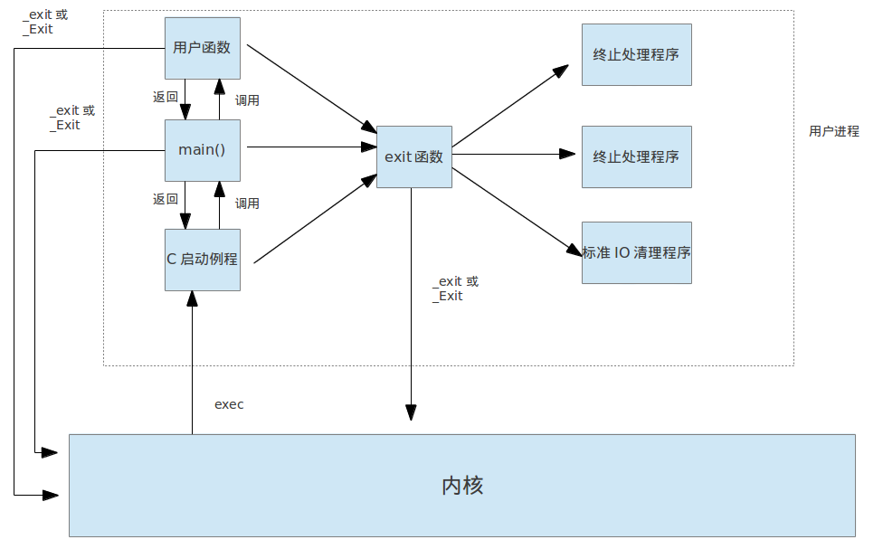

### C程序启动和终止

内核执行C程序时, 通过内核的exec启动一个进程, 然后在进程中运行一个`C启动例程`, 并作为程序的起始地址, 然后调用main方法.

有8种方法终止进程:

1. 从main方法返回
1. 调用exit
1. 调用_exti 或 _Exit
1. 最后一个线程从启动例程返回
1. 最后一个线程调用pthread_exit
1. 调用abort
1. 接到一个信号终止
1. 最后一个线程对取消请求做出响应

基中最后三个为异常终止方法.

exit函数:
```c
#include <stdlib.h>
void exit(int status);
void _Exit(int status);
#include <unistd.h>
void _exit(int status);
```
**注意:** `exit`和`_exit`,`_Exit`的区别是, 前者先执行一些清理动作(如关闭进程打开的标准IO流),再进入内核; 而后者是直接进入内核.

#### atexit函数
```c
#include <stdlib.h>
int atexit(void (*func)(void)); //返回值: 成功返回0
```
上面我们说`exit`方法在退出进入内核之前会执行一些清楚动作, 如挂载的终止处理程序, 打开的流文件. 这些挂载的终止处理程序就是通过`atexit`方法实现的.看如下代码段:
```c
static void my_exit1(void);
static void my_exit2(void);


int main(int argc, char *argv[]){
    if(atexit(my_exit2) != 0){
        err_sys("can not register 2");
    }
    if(atexit(my_exit1) != 0){
        err_sys("can not register 1");
    }
    if(atexit(my_exit1) != 0){
        err_sys("can not register 1");
    }

    printf("main is done\n");
 	return 0;
}

static void my_exit1(void){
    printf("1 is exit\n");
}

static void my_exit2(void){
    printf("2 is exit\n");
}
```
打印:
```bash
main is done
1 is exit
1 is exit
2 is exit
```
执行的顺序和挂载的顺序是相反的.


