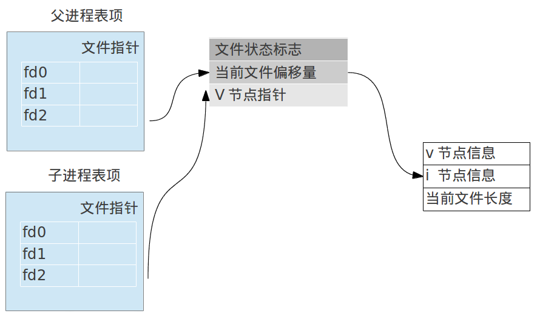

### 进程标识符
每个进程都有一个唯一的非负整数进程ID, 因为系统在运行的过程中进程会销毁和创建, 但是整数是有限的, 所以进程ID整数是循环使用的. 具体的重复使用机制, 就是每次有新的进程产生时, 在当前最大的进程ID上加1, 然后如果该数没有大于系统允许的最大进程限制数的话, 就分配使用, 否则, 又从头(0)开始分配, 不过如果遇到该整数代表的进程ID还是存活的, 则跳过分配下一个, 依此类推. 参见: [进程ID整数分配](http://superuser.com/questions/135007/how-are-pids-generated)

获取进程函数:
```c
#include <unistd.h>
pid_t getpid(void);//调用进程的进程ID
pid_t getppid(void);//调用进程的父进程ID
```

### fork函数
```c
#include <unistd.h>
pid_t fork(void);
```
`fork`函数执行后, 程序接下的执行环境有两个: 父进程执行环境和亲产生的子环境执行环境. 根据`fork`的返回值可以确定当前的环境: 返回0代表是子进程中; 大于0则是父进程环境. 子进程会获得父进程的数据空间, 堆, 栈的副本, 但是共享正文段(参见上节进程环境介绍).

#### 文件共享
fork的一个特性就是把所有打开的文件描述符都复制一份到子进程中, 父, 子进程的每个相同的文件描述符都指向同一个文件表项, 即共享相同的文件偏移量等相关信息. 如下图:


下面看一个例子:
```c
#include "apue.h"
#include <fcntl.h>

int main(int argc, char *argv[]){
    char str1[] = "child process wirte";
    char str2[] = "parent process wirte";
    pid_t pid;
    int fd = creat("/home/tony/data.txt", FILE_MODE);
    if((pid = fork()) < 0){
        err_sys("writer error");
    }else if(pid == 0){//进入子进程
        printf("before child wirte, pos: %d\n", lseek(fd, 0, SEEK_CUR));
        write(fd, str1, sizeof(str1));
        printf("after child wirte, pos: %d\n", lseek(fd, 0, SEEK_CUR));
    }else{//进入父进程
        sleep(2);//让父进程休眠2秒, 避免并发引起数据不一致
        printf("before parent wirte, pos: %d\n", lseek(fd, 0, SEEK_CUR));
        write(fd, str2, sizeof(str2));
        printf("after parent wirte, pos: %d\n", lseek(fd, 0, SEEK_CUR));
    }
    return 0;
}
```
输出:
```bash
before child wirte, pos: 0
after child wirte, pos: 20
before parent wirte, pos: 20
after parent wirte, pos: 41
```
可以看到, 虽然两个进程都拥有相同的文件描述符(代码中的变量`pid`), 但是同时进程相关流操作(lseek, write)还是基于同样的文件信息表数据. 这就是进程间的文件共享.


