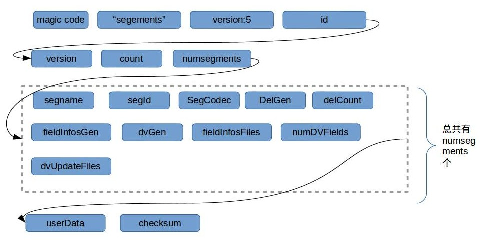
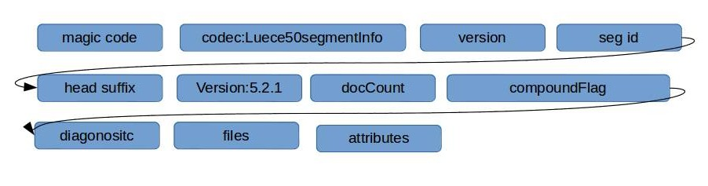
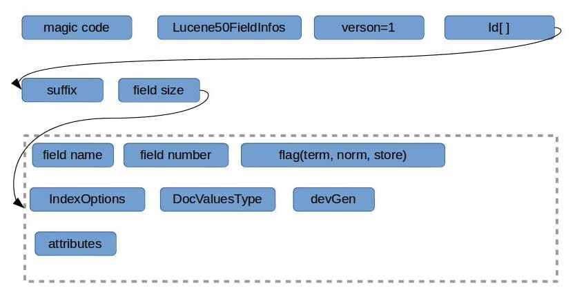
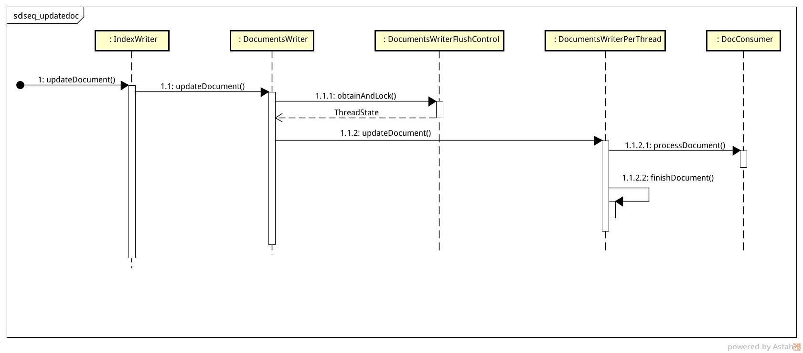
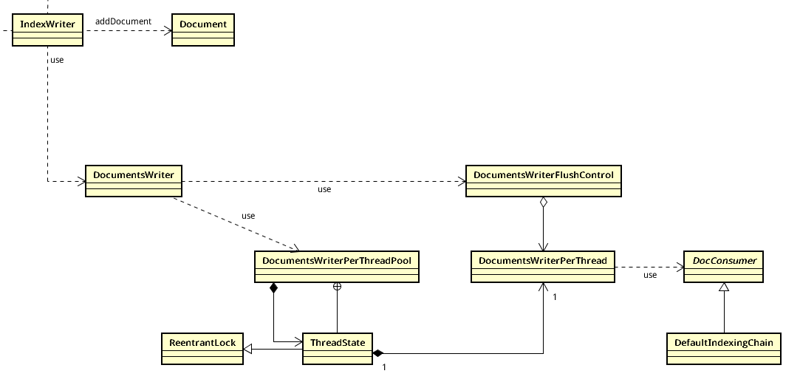

# 索引概述

「索引」，可以作为一个动词，也可以是名词。作为动词的时候，指分析原始文件，分词，存储一系列动作；而作为名词，一般指已经处理好的索引文件。索引，是整个IR系统的核心，先有索引，再有查询。

## SegmentInfos

**代码：** org.apache.lucene.index.SegmentInfos#readCommit(org.apache.lucene.store.Directory, org.apache.lucene.store.ChecksumIndexInput, long)  
**文件：** segments_N

所有索引文件保存在`Directory`下，一个索引包含很多不同作用的文件，其中有个文件最重要：segments_N，这个文件包含了很多元数据信息，比如当前索引的版本，segments数量。随便写个demo生成索引文件后，一般会有个segments_N文件，其中 N 是36进制的数字格式，如1，2，3 ...。分析下这个二进制文件(我用vim的%!xxd查看的)的数据：

## Segment

**代码：** org.apache.lucene.codecs.lucene50.Lucene50SegmentInfoFormat#read  
**文件：** _0.si

	我之所称这个文件是元数据信息，因为真正的索引数据不是放在这里，而只是保存了怎么读取索引文件的信息，可以理解成二级索引。上图中可以看到有个`numsegments`字段信息，这表示当前索引有多个 segment 存在，如果有多个，依次加载 segment 信息。每个 segment 文件名称一般以_0.si，_1.si，来保存的。举个例子，如果当前索引有两个segment块，则分别加载读取_0.si和_1.si的信息。记住一点：segment_N文件下保存了1到多个_n.si文件信息。那每个si文件包含哪些信息，同样查看下si二进制文件，有如下格式：

每个 segment 文件对应的都有一个文档字段信息数据文件，以 _0.fnm 命名的文件。参见代码（org.apache.lucene.codecs.lucene50.Lucene50FieldInfosFormat#read），其包含的信息为：

当更新索引文件时，包括新增，删除索引，一般中间过程中变更数据都放在内存中，当达到某些条件的时候会触发 flush 操作，即把内存的数据刷到文件中。flush 和 commit 是不同的两个东西，前者是把数据从内存中刷到文件系统中，后者代表一个事务的完成。也就是 flush 操作成功后，并不代表这些数据就是最终要保存的一致性数据。fush 策略由`FlushPolicy`负责，比如当内存使用或变更文档个数到达了预先设置的值，则触发flush。

Lucene索引文件具有有很高的吞吐量，官方描述如下：

> Scalable, High-Performance Indexing
> over 150GB/hour on modern hardware
>small RAM requirements -- only 1MB heap
> ...

这得益于Lucene内部实现种种细节的性能优化手段，如可以并发索引，先缓存数据在内存再批量刷新到文件。下图是一个在执行`IndexWriter.addDocument`时调用栈图：

从上图可以看到，所有的索引操作任务都通过内部一个`DocumentsWriterFlushControl`来调度，它具体的工作就是根据计算机的硬件参数(如CPU核数，内存大小)来控制并发量，并决定何时把内存的数据刷回到持久层文件中。`DocumentsWriterPerThreadPool`这个类从命名上可以看出，这是个**池**，和我们熟悉的线程池，数据库连接池一样，从系统系统启动时初始化一批资源，在以后的系统调用中，每次先从池中申请，执行任务，然后释放资源返回给池。

我们再从类的关系图看下：

# 倒排列表(posting list)组织形式
`posting list`在IR中是一个基本重要的概念，如果不懂的可以参考下：[倒排记录表](http://www.cnblogs.com/jcli/archive/2012/09/27/2683417.html)。该记录表中记录最重简单最基本的信息是**文档ID**，但是除了文档ID，从信息检索的丰富性上来，一般还有其它信息。在Lucene中，记录表中记录的信息分类通过`IndexOptions`枚举来区分。

1. NONE: 不存储任何信息。
1. DOCS: 只保存文档ID。
1. DOCS_AND_FREQS: 还保存词的出现频率。词项频率作用于评分权重，词项向量相似度计算。
1. DOCS_AND_FREQS_POSITIONS: 还保存词项出现在文档中的位置，可用于查询使用短语查询（所谓短语查询，就是一个短语中的词不但出现在文档中，而且出现位置顺序是一致的）
1. DOCS_AND_FREQS_POSITIONS_OFFSETS: 还保存词项在文档中原始偏移位置。可用于高亮显示之类。

上面五种类型，保存信息层层增多，从不存储任何信息，到最后保存所有词项信息。

