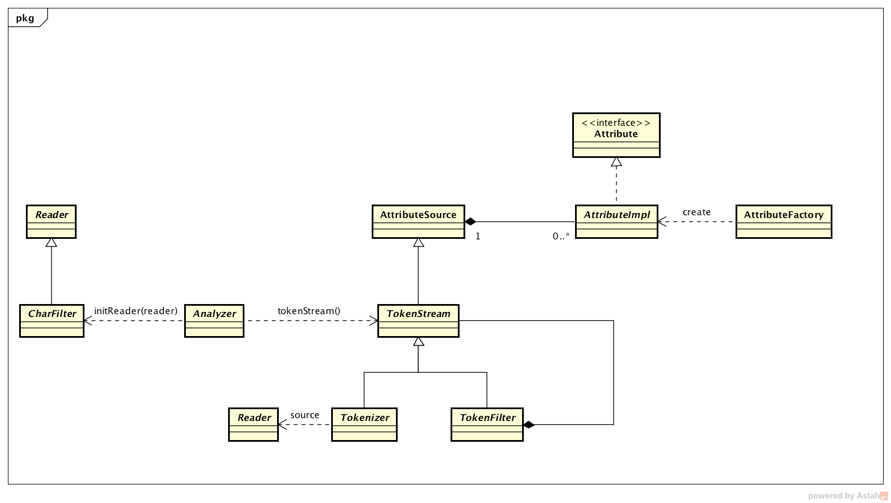

# 分词
「分词（tokenizer）」在IR系统占据比较重要的一块，它直接影响我们查询的召回率。我们知道索引文件中是以term为单位，而且IR系统中原始文件和查询的输入都是整个词组，句子或者文章，IR系统要把它们切分成一个个的term， 然后组织索引文件。因为世界语言丰富性及行业专业词汇存在，分词也有一定复杂性。而在 Lucene 中，它提供了一套可扩展完备的API接口方便大家提供自己的分词逻辑，而且 Lucene 本身也内置提供了一些功能强大的分词词。

## Lucene API Spec

Notes:

* 自定义扩展分词器，继承自 Analyzer。
* 便是一般分词逻辑在自定义的 TokenStream 中，由 Analyzer 调用 TokenStream，所以 Analyzer 一般写成匿名实现。
* TokenStream是个抽象类，它有两个很重要的抽象子类：Tokenizer 和 TokenFilter
* Tokenizer 和 TokenFilter 的作用区别。Tokenizer的输入是 Reader，对输入做分词的核心逻辑在这里实现；而 TokenFilter 的输入是 TokenStream，对原始 TokenStream 包装并加强。大家应该看出用的是「装饰器模式」。所以自定义的 Tokenizer 一般用 final 修饰，其它人想加强或者附加功能会以 Tokenizer 为输入。
* TokenStream 继承自 AttributeSource，而 AttributeSource 是聚合 Attribute 的容器。所以 TokenStream 一般会在通过在分词过程中保存很多信息供外部使用。一般使用的多的是：OffsetAttribute 和 CharTermAttribute，前者保存Term的偏移量，后者保存Term的本身信息。
