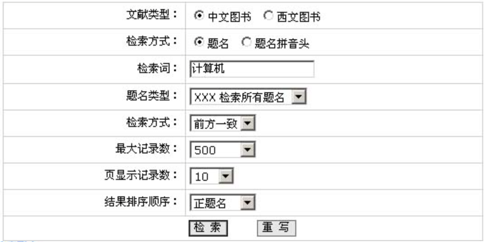
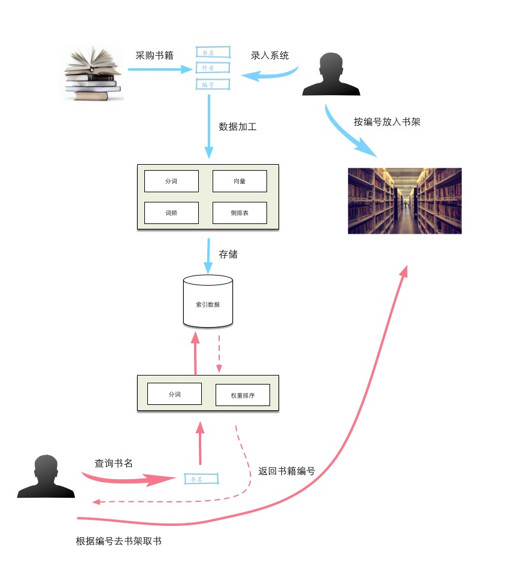
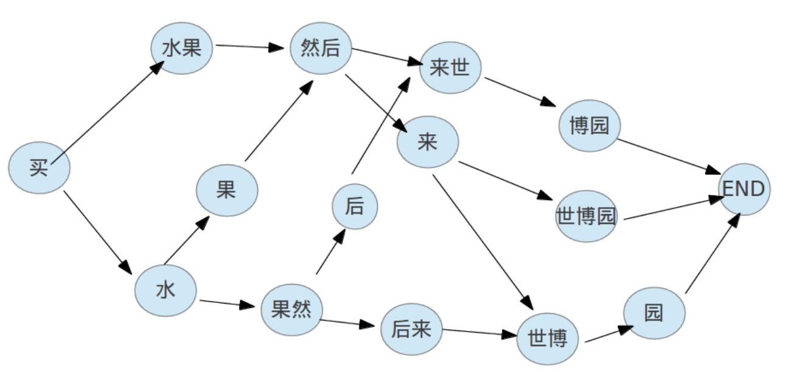
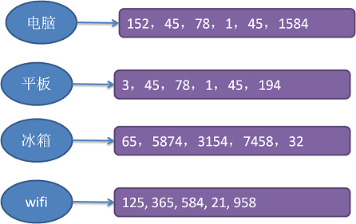
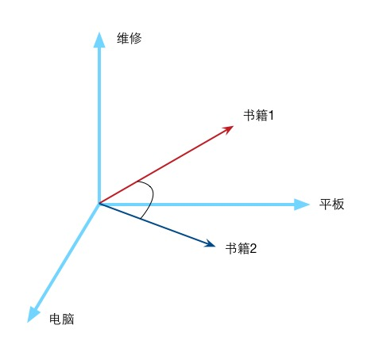

# 信息检索场景
上周五快下班时，正在做一个系统的某个运营功能模块，很简单的一个功能，其中有个要求是，根据手机号查找用户信息，和前端同学联调接口的时候，他顺便闲问了一句，这个功能是通过SQL的`like`关键字完成的吧，我说对啊，就是这样做的，反正我们的数据量不大。接下来他说道，像 baidu，google，这样的产品是怎么做到在毫秒级别时间内从互联网海量数据中查询出我们想要的结果呢？要完成这样的工作，在一个搜索框的背后，那当然是一个工业级的技术体系去支撑。但是在这里，我想尽可能用我所了解的浅显的知识介绍下信息检索技术的基本原理，算个科普入门吧。

我们听到的`搜索`，`信息检索`，差不多描述的同一个事，反正目的就是帮助我们从大量数据中快速定位查找我们想要的东西。在我们日常生活中有很多这样的场景，如我们去图书馆借书，面对几层楼的浩瀚书海，你是用什么方法借到你想的书的呢？


我们一般先要去图书检索区找台电脑，打开检索系统查询页面，输入关键字，关键字一般为书名，或者作者名，就可以列出所有相关的书籍及很重要的一个信息，就是书籍的存放编码，如 J4223，我们就可以去 J 区查找编号为 4224 的该书了。



如上所述，图书馆检索系统就是一个典型的应用场景，下面文字就是以图书管检索系统为例，讲解下一个基本的信息检索系统是怎么建立及运作的。


# 工作机制
请参考下图，一个完整的检索系统分为两部分：索引和查询。上面蓝色部分索引过程，下面红色部分是查询过程。索引部分的主要工作为：

1. 准备原始数据，在图书馆检索系统里就是我们采购得到的书籍。我们给每本书分配一个唯一书籍编号。这样每本书就有几个基本属性：书名，作者，编号。图书馆工作人员把每本书的资料录入到检索系统里。
1. 检索系统根据工作人员录入的信息进行加工处理，最重要的步骤包含**分词**，下面会重点介绍这。
1. 检索系统把上面的分词及其它加工处理后的信息存储起来。
1. 工作人员把书籍根据其编码放在相应的书架上。

查询部分主要工作是：

1. 在检索系统的查询界面上，输入我们要查找书籍的关键字，一般是书名。
2. 检索系统根据用户的录入信息，进行分词，得到离散的词项，然后根据这些词项从索引存储区查找到跟它们相关的书籍编码，如果有多本书满足条件，则根据相关权重计算算法，返回相关性较高的那些书籍。
3. 用户有了书籍编码，就可以根据图书馆的书架摆放规则快速找到对应的书。



## 分词
『分词』的作用就是，把一条句子或者短语根据最佳语义组成规则拆分成一个个离散的词语（词项）。这里举个例子更清晰，看如下一句话：

    买水果然后来世博园。
    
我们看一眼后应该都会这样拆分：买，水果，然后，来，世博园。有些东西人类一眼就能看出来的东西，很多时候是凭经验，感受来作决定，但计算机就茫然了。计算机是完全按照人类输给它的指令来做计算的，你能把你的直观感受告诉它吗，当然不能。但是人类所作的判断从科学上来讲也是基于一套理论或者历史数据（经验）来推出的。比如上面那句话的拆分，表面上看我们是一眼看出，其实不然，实际我们的脑子在接收到这个句子后迅速把各个拆分的可能性都过了一遍，然后在这些拆分组合中找到了一个更符合当前场景的一个。不信，放慢你的思维再试一下。你是不是有如下的一些思考过程：



我们在句子的第一字开始，挨个尝试各个组合，最终找出我们的最优组合。为什么觉得『买，水果，然后，来，世博园。』是最优的呢，判断标准是什么？在这个句子里，`世博园`好像是不可拆分的，不然就不通了。我们可以有这样一个思路，给每个词组都**预先**赋予一个权重值，然后计算出每个拆分组合下的总权重值，找出所有组合中总权重值最大的那一个，即是我们想要的最优拆分。你是不是忽然觉得这样的思路很熟悉，好像经常碰到，没错，这就是动态规划中计算最段解的思路。

这里介绍一个国人写的很不错的中文分词库，[结巴分词](https://github.com/fxsjy/jieba)。里面关于分词的动态规划计算权重的代码片段如下：

```python
def calc(sentence,DAG,idx,route):
    N = len(sentence)
    route[N] = (0.0,'')
    for idx in xrange(N-1,-1,-1):
        candidates = [ ( FREQ.get(sentence[idx:x+1],min_freq) + route[x+1][0],x ) for x in DAG[idx] ]
        route[idx] = max(candidates)
```

## 倒排记录表
上面所说的分词所做的工作只是把一个句子拆分成一组离散的词组（词项），有了这些词组，我们就可以建立一个关系表，即『词组 - 书籍列表』的关系表。如下图：



我们可以这样把这个倒排记录表表示成这样一个数据结构：`Map<Key, List<Book_Code>>`，一个大容量的字典容器，其中Key值存放的上面分词步骤中得到的词组，Value部分存放的是包含了该词组的书籍列表。

## 查询

到现在为止，我们获得了什么？一个`Map<Key, List<Book_Code>>`结构的字典数据。这个字典的用途就是给我们做信息查询用的。比如我们现在想要找一本『平板电脑的基本维修』这本书，我们只需要打开检索系统查询界面，输入“平板电脑维修”这几个关键字，系统就会运用前面所说的分词技术，把输入的“平板电脑维修”拆分成“平板，电脑，维修”三个词组，然后根据上面的字典结构查询得出相关的书籍编码列表，返回这些书籍和用户输入的查询关键字相关：「3，45，1，78，152，194，1584」。有了这些书籍编号，你就可以去对应的书架上拿书了。

## 向量权重
上面部分我们完成了书籍查询的功能，但是好像返回的书籍列表有点多，很多时候这些书籍只有部分书能满足我们的要求，所以需求来了：检索系统要计算过滤出那些与我们输入的查询条件关联性更强的那些书列表。上面提到我们输入的查询关键字分词后为“平板，电脑，维修”，这里我们以这三个词组为三个维度方向（你进了一个三维的空间：（平板，电脑，维修）），每个词组出现的频率为维度量值。这样每本书籍也好，或者任何一个句子，在这个三维空间中，都有自己的唯一值。句子“平板电脑维修”的值就是：（1，1，1），假设编号为45的书籍的值是：（45，98，34），编号为78的书籍的值为：（23，45，23）。很明显，书籍45比书籍78更符合我们的搜索需要。我们可以用两个向量的内积表示两者的相似度。



这里用一段伪代码来描述下如何计算给定一个查询q，计算并找出排在前M位的文档。下面我们简化了查询q中每个词项的权重，存在的词项都是相同的权重且设置为１，其实这是不影响总体排序的，因为排序是用相对比较而不是绝对值。

```python
def calScore(q):
    # 初始文档的评分为0，文档长度为N
    scores = [0 for i in range(N)]
    for t in q:
        # 遍历查询q中所有的词项
        for d in post_list(t):
            # 遍历词项t的倒排记录表，累加词项和文档的权重
            scores[d] += wf_td   
    # 获取权重最高的前Ｍ个数据
    return top M of scores
```

# 开源解决方案
如果要在自己的项目中使用到信息检索功能，可以使用[Apache Lucene](!http://lucene.apache.org)。引用它的官方特性描述：

	- over 150GB/hour on modern hardware
	- small RAM requirements -- only 1MB heap
	- incremental indexing as fast as batch indexing
	- index size roughly 20-30% the size of text indexed
	
而如果你的业务量比较大，索引数据受到单机配置限制，或者想使用高可用方案，保证系统可用性，可以使用基于 Lucene 的 [ElasticSearch](https://www.elastic.co) 方案，而且相对于 Lucene 的API，ElasticSearch 的 RESTFUL 风格调用方式，更加方便使用。

