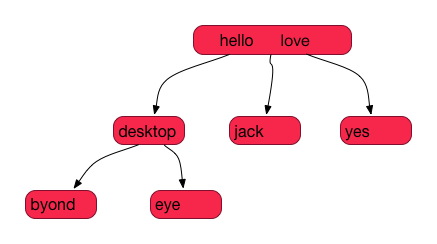
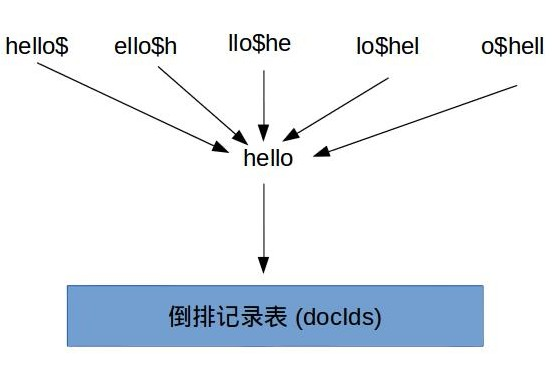

上篇文章中我们了解了一个完整搜索系统的基本构建和运作流程，去掉细节不谈，最重要的两步就是：构建索引 和 执行查询。而本篇文章里我们比较系统的了解下查询的一些常用方法，及背后的大概原理。

从一个搜索系统用户的角度出来，打交道最多的就是查询。说到查询，大部分人觉得没什么，无非就是输入关键词并希望系统返回具有相关性的结果。一个查询系统其实提供了很多丰富的查询方式供我们使用，而我们大多数情况下只使用一些最基本的查询方法。这里以 Google 为例，查看它的[帮助文档](https://support.google.com/websearch/answer/2466433?hl=en)，发现查询本身也是一门技术活，了解更多的查询方法，可以帮助我们提高查询返回的准确率且平衡好召回率。

# 索引数据结构
在了解`查询`前，有必要先介绍下索引是以什么样的数据结构存储的。搜索系统中的索引结构和数据库系统中的索引结构其实差不多，为了根据关键字快速查找到相应的数据，一般有两种常用数据结构：哈希表 和 B树 结构。哈希表可以做到O(1)的查询速度，但是为了避免冲突，一般要浪费不少存储空间（完美哈希可以解决这个问题），而且还有一个缺点是数据不是有序存储，对于范围查找或者前缀查找不友好。而B树结构也可以做到logN的查询效率，且数据有序，适合磁盘存储。这里不详细介绍这些数据结构，不是很熟悉的朋友可以找下算法和数据结构的书看下。


# 查询常用方法分类

## 精确查询
根据输入的查询关键词在索引中确定其位置，在B树中确定一个节点的时间是logN，N是索引数据节点的总个数。这个不难理解，这里不做过多篇幅讲解。

## 范围查询
如果我们查询价格范围在 [100 - 200] 内的商品，则我们只要遍历扫描B树中数值为 100 和 200 两个节点之间的所有数据，所以时间是logN + m，基中 m 是所有价格在100和200之间的商品总数。所以范围查询就是一次精确查询确定起始结点然后遍历所有满足条件的数据。

## 前缀模糊查询
有时候我们在查询时不确定整个要查询的关键字，只记得以某个词开头。比如根据姓名查询时，我们记不清全名而只记得部分，输入“北原多*”，也能查询出“北原多香子”的文章出来。在B树结构中，只要在logN时间内定位到“北原多”，然后遍历所有以这开头的词即可。
## 全局模糊查询
前缀查询是确定查询词项的前面部分，但是如果我们连开头部分都不确定，只是零散记住中间某些部分时又怎样处理呢？根据B树结构特点，查询过程是根据待查询词分解后从前往后搜索定位的，而对于“*香子”这样的后缀查询是没有办法处理的。此路不通我们变通下方式，把整个词项**倒过来**就行了。我们在建立索引数据时，对每个词项做一份冗余索引，即多做一次**倒置索引**，比如对“北原多香子”做索引时，冗余一份“子香多原北”，现在对于后缀查询“\*香子”在执行查询前先倒置下，变成查询“子香\*”，OK，现在又变成前缀查询了，问题完美解决。

聪明的你可能又发现问题了，如果我们即不是前缀查询，也不是后缀查询，而是“\*香多\*”形式的查询，何解呢？这时候我们在索引构建时要做一些额外的工作，叫做**轮排索引**。什么叫轮排, 举个例子, 如果对于词项hello来说, 我们会同时生成hello$, ello$h, llo$he, lo$hel, o$hell, 它们都指向原始词项hello. 这样假如我们现在要查询 he\*o 时, 我们只要在该查询关键字后面加上$然后旋转到 * 出现在最后面，得到 o$he* ， 然后在轮排词典执行前缀查询, 就可以查询得到到所以对应的原始词项，即和 hello 有关系。如下图可以清晰说明这种关系。

## 短语查询
比如我们输入“boy friend”查询，希望返回的内容不只是包括了“boy”和“friend”这两个词项的文章，而是包含准确的“boy friend”这个短语，即满足“boy”这个词项刚好在“friend”的前面相邻的位置上。

要做到这点，在构建索引阶段，倒排表除了保存文档id外, 还保存在该词项在每个文档中出现的位置. 比如词项boy在文档1中出现在第2个位置, 在文档2中出现在第4个位置, 在文档3中出现在第2个位置. 有了这个索引存储结构, 要找出不同的短语就比较容易了, 比如用户想搜索"boy friend", 只要找出在文档中, boy出现的位置刚好在friend前一个位置的所有文档.  下面用python简单实现下这个算法:
```python
# p1, p2是两个上述结构的倒排记录表, k是两个词项的位置在k以内
def positional_interset(p1, p2, k):
　　result = [] # 最终的搜索结果, 以(文档id, 词项1的位置, 词项2的位置)
    while p1 is not None and p2 is not None: # 当p1, 和 p2 都没有达到最尾部时
        if p1.docId == p2.docId: # 如果两个词项出现在同一个文档中
            l = [] # 临时变量, 用来存储计算过程中满足位置距离的位置对信息
            pp1 = p1.position
            pp2 = p2.position
            while pp1 is not None: # 先固定pp1的位置, 循环移动pp2的位置进行检查
                while pp2 is not None:
                    if abs(pp1.pos - pp2.pos) <= k: # 如果pp1和pp2的距离小于k, 则满足要求
                        l.append(pp2.pos) # 添加到临时变量
                        pp2 = pp2.next # pp2向后移一个位置
                    elif pp2.pos > pp1.pos: # 如果pp2当前的位置相对pp1已经超过给定的范围(构不成短语要求), 则停止移动pp2, 后续后把pp1再往前移动一个位置
                        break
                while not l and abs(l[0] - pp1.pos) > k: # 当每次移动一次pp1时, l里面会存储上一次计算所得的pp2的一些位置, 这里要过滤那些相对于当前pp1最新位置, 那些不再满足要求的pp2的位置
                    del l[0]
 
                for p in l:
                    result.append[(p1.docId, pp1.pos, p)] # 把最终的结果加入到结果集中
 
                pp1 = pp1.next # pp1向前移动一个位置, 重复上次逻辑计算
 
            p1 = p1.next
            p2 = p2.next
        elif p1.docId < p2.docId:
            p1 = p1.next
        else:
            p2 = p2.next
```

## 自动纠正查询
我们在输入查询词, 经常不确定或者记错, 导致输入和实际想要的看起来相似, 但是又是错误的, 比如:


这里用到的技术就是要计算两个词的相异程度, 专业的术语叫做[编辑距离(edit distance)](http://en.wikipedia.org/wiki/Edit_distance). 编辑距离最早由俄罗斯科学家Levenshtein于1965年提出, 具体的算法则是1974由Wagner和Fischer提出. 这里我们来详细讨论下.

两个单词s1, s2的差距, 可以这样来理解: 把s1变成s2要经过多少步骤. 比如把"kitten" 变成"sitting", 要经过下面三步:

kitten -> sitten (把k替换成s)
sitten -> sittin (把e替换成i)
sittin -> sitting (在后面加上g)
所以kitten和sitting的编辑距离是3. 这里用python写出这个核心算法:

```python
def edit_distance(s1, s2):
    m = len(s1)
    n = len(s2)
    d = [[0 for j in range(n + 1)] for i in range(m + 1)] # 先初始化一个二维数据, d[i][j]表示s1的前i个字符组成的字符串和s2前j个字符组成的字符串的编辑距离
    for i in range(m + 1): # 初始化d[i][0]为i.  这点很容易理解, s1的第i个字符转变成空白字符串(j=0), 只要去掉i个字符就可以了, 所以操作数是i
        d[i][0] = i
    for j in range(n + 1): # 初始化d[0][j]为j, 和上面一样, s2第j个字符之前组成的串变成空白字符串(i=0), 只要去掉j个字符就可以了, 所以操作数是j
        d[0][j] = j

    for i in range(m):
        for j in range(n):
            if s1[i] == s2[j]: # 如果s1的第i的字符等于s2的第j个字符, 那么这一步操作就不用做, 所以编辑距离就是s1的第i-1个字符和s2的第j-1个字符的编辑距离
                d[i+1][j+1] = d[i][j]
            else:
                d[i+1][j+1] = min(d[i][j+1] + 1, d[i+1][j] + 1, d[i][j] + 1)  # 在基于前面一步的基础上, 把s1删除一个字符, 或者把s2插入一个字符, 或者把s2的第j个字符替换成s1的第i个字符

    print 'the edit distance is %s' % d[m][n]
```
 
# 结束
这篇文章主要是介绍了我们常用的一查询方法及相关原理。在本系列的下篇文章里，我们谈一谈查询返回结果的评分排序问题。

