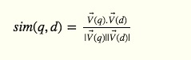
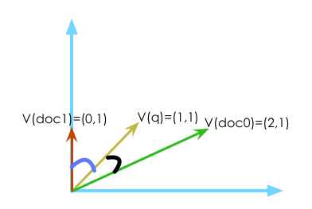
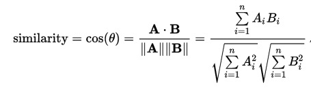
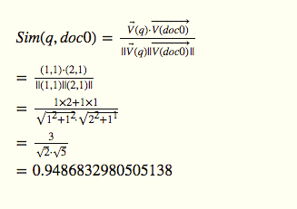
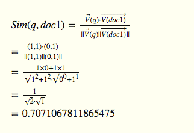
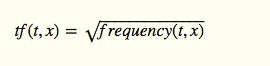
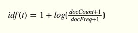

我们知道文本搜索中，召回率和准确率是很重要的两个指标，但是返回文档的`相关性`也很重要，这直接影响到返回文档集的优先顺序。最近在看ElasticSearch5.0（还是Alpha版），发现其基于的Lucene也升级到了6.X版本，重大变化之一就是把默认相关性算法从TF-IDF换成了BM25。这里大家一起了解下这两种算法及区别。

# 数据准备
这里为了更简单清晰的描述算法本身，演示数据尽可能简单点。假设有三篇文档（document），每个文档只有一个字段（field），字段名叫name。

  > doc0: tony is tony, my name is feiei  
  > doc1: tony hehe  
  > doc2: welcome pony
  
查询条件（query）“name, tony”先被分词成两个词语(term)：name 和 tony，然后返回所有包含了 name 或者（or）tony 两个词语的文档。从上面的准备数据文档中，将会返回doc0和doc1两个文档。正确返回所有文档不难，但还要返回文档的优先级顺序，`顺序`在很多场景下都是很重要的因素，人们总是喜欢优先看到更匹配的内容。可以把每个返回的文档计算一个得分（score），然后按照得分大小排序后返回即可。计算得分的规则有不同的方式，下面我们就聊下几种算法。

这里说点题外话，估计大部分同学一看到数学公式就有点头晕，我觉得这是一种误解看法。数学公式就像我们做软件开发前画的UML设计图一样，都是对复杂规则的抽象描述表达，能用图表达的，就不要说一堆话来表达。一样的，数学公式可以从更高的层次把难以用语言表达清楚的概论给直观的抽象出来。我们有时候缺的是一种耐心去分析思考这公式后面所蕴含的意义。

# TF-IDF算法
## 向量空间模型

TF-IDF是基于[向量空间模型](https://en.wikipedia.org/wiki/Vector_space_model)来计算，所以先介绍向量空间和余弦相似度。


<!-- 
\begin{equation} 
sim(q,d)=\frac{\overrightarrow{V}(q).\overrightarrow{V}(d)}{|\overrightarrow{V}(q)||\overrightarrow{V}(d)|} 
\end{equation}
-->
上面公式中就是计算查询q和文档d之间的相似度。我们以上面的准备数据详细分析下：

V(q) = (tony在q中的频率次数, name在q频率次数) = (1, 1)  
V(doc0) = (tony在doc0中的频率次数, name在doc0频率次数) = (2, 1)  
V(doc1) = (tony在doc0中的频率次数, name在doc0频率次数) = (0, 1)

doc3中即不包含tony也不包含name，所以直接过滤去掉。V(q)，V(doc1)，V(doc2)都是二维向量，我们可以在平面坐标上画出来：



从上面二维向量坐标图上容易看出，V(q)和V(doc0)的夹角比V(q)和V(doc1)小。在向量空间模型中，两个向量的夹角越小则越表示其越相似，在数学里叫做[余弦相似度](https://en.wikipedia.org/wiki/Cosine_similarity)（cosine similarity）。



下面分别计算下Sim(q, doc0)和Sim(q, doc1)的值：



<!--
\begin{equation} 
Sim(q,doc0)=\frac{\overrightarrow{V}(q)\cdot\overrightarrow{V(doc0)}}{||\overrightarrow{V}(q)||\overrightarrow{V(doc0)}||} \\
=\frac{(1,1)\cdot(2,1)}{||(1,1)||(2,1)||} \\
=\frac{1\times2+1\times1}{\sqrt{1^2+1^2}\cdot\sqrt{2^2+1^1} } \\
=\frac{3}{\sqrt{2}\cdot\sqrt{5}} \\
=0.9486832980505138 \\
\end{equation}
-->


<!--
\begin{equation} 
Sim(q,doc1)=\frac{\overrightarrow{V}(q)\cdot\overrightarrow{V(doc1)}}{||\overrightarrow{V}(q)||\overrightarrow{V(doc1)}||} \\
=\frac{(1,1)\cdot(0,1)}{||(1,1)||(0,1)||} \\
=\frac{1\times0+1\times1}{\sqrt{1^2+1^2}\cdot\sqrt{0^0+1^1} } \\
=\frac{1}{\sqrt{2}\cdot\sqrt{1}} \\
=0.7071067811865475 \\
\end{equation}
-->

我们可以用大白话解释下上面公式：分子是两个向量的元素点积，即两个向量在每个维度上的值两两相乘后相加，如果两个向量方向一致则形成合力变得更强大，如果两个向量方向相反，则相互抵消。比如(1, 1)是往左走，(-1,-1)往右走，相互作用后则完全抵消。但是(1,1)和(2,2)方向相同，则叠加后更加强大。而分母就是对刚才的分子结果作归一化，或者理解成单元化。举个例子就明白了：(1,1)和(2,2)两个向量方向一致，（1，1）和 （3，3）也是完全方向一致，而不用管两个向量的长度，所以为了消除其长度影响除了一个向量长度信息。

## TF-IDF引入
上面章节中的向量空间模型中，每个向量的组成元素是词项出现次数：`frequency(t,x)`。即词项t在文档或者查询x中出现的次数。但是为了更好匹配质量，使用`tf(t,x)*idf(t)`来替代`frequency(t,x)`。

**tf（t,x）的定义：**



<!--
\begin{equation} 
idf(t,x) = \sqrt{frequency(t,x)}
\end{equation}
-->

√frequency(t,x)|q|doc0|doc1|doc2
---|---|---|---|---
tony|1|√2|1|0
name|1|1|0|0

上面`词项`（第一列）和`文档或查询`（第一行）两两相交的地方就是其tf(t,x)值。

**idf(t)定义：**



<!--
\begin{equation} 
idf(t) = 1 + log\lgroup{\frac{docCount + 1}{docFreq + 1}}\rgroup
\end{equation}
-->

`docCount`表示文档总数，本文示例数据中，总共3篇文档(doc0,doc1,doc2)，所以docCount为3。`docFreq`指包含了词项t的文档数量，所以docFreq('name') = 1，因为name只出现在doc0中。docFreq('tony') = 2 ，因为doc0和doc1都包含了tony。所以idf(t)可以表示词项t的`特殊性`，如果词项t在每篇文档都有出现，则说明t没有识别度，相反如果t只在少数个别文档中出现，即说明词项t非常特殊，应该拥有更高的权重地位。这里再个举个例子来更好理解，在一个卖手机的电商网站上，以“华为手机”为关键字搜索，因为“手机”这个词项基本在每个商品中都会出现，所以没有识别度，但是“华为”可能只在部分商品中出现，所以更是我们想要得到的。

从上面可以看出，无论是对tf公式中的平方根，还是idf的对数函数，都是基于现实的情况，两篇文档的相关度并不是简单和原始参数成正比，当值相差太大时，我们要调和这种差别。


## Lucene基于TF-IDF其它优化

Lucene对tf-idf做了很了很多改进，这里一一说下。

### 引入文档长度影响因子
根据前面和向量空间模型中的余弦相似度公式，我们对向量做了归一化处理，所以向量 V(1,1) 和 V(2, 2) 的相似度和 V(1,1) 和 V(3,3)是一样的，这样完全忽略了文档本身的长度信息。这里举个数据例子，两个文档分别是：

文档1：i think that  
文档2："I think it's unlikely to be a real thing. I'm sure it's an overreaction about an already-skittish party," Roberts said. "They have looked at what happens in that circumstance.", hello, i love the word.

当我们搜索“think”关键字，虽然"think"在两篇文档中都只出现一次，如果按照之前公式，相似度值是一样的，但这里我们明显更希望返回文档1，因为文档2除了包含“think”，同时也包含了更多其它词项。所以在Lucene中，对文档长度归一化处理换了一种思路，引入了norm(t,d)：相同的词项出现次数，如果文档更长，则norm(t,d)更小，如果文档更小，则norm(t,d)更大。


<!--
\begin{equation} 
norm(t,d) = \frac{1}{\sqrt{numTerms}}
\end{equation}
-->

公式中 numTerms 是文档d中包含的所有词项数量，从公式看出，文档越长，numTerms越大（不考虑词项大量重复出现情况），norm(t, d)越小。

### 引入词项权重，字段权重

在索引或者查询阶段，每个字段(field)，每个词项(term)可以设置不同的权重值(boost)，提高我们的期望返回准确率。

### TF-IDF更多介绍文章

  1. [「Information Retrieval」](http://nlp.stanford.edu/IR-book/html/htmledition/queries-as-vectors-1.html)，该教材是斯坦福大学信息检索课程，简称IR，是很好的入门学习教材。有中文译本。
  2. [Lucene API Doc: TFIDFSimilarity](https://lucene.apache.org/core/6_1_0/core/org/apache/lucene/search/similarities/TFIDFSimilarity.html) 详细说明了if-idf的原理及lucene实现思路。


# BM25算法
BM25算法则从`概率模型`理论出发推演出的一套相关性计算公式。相比TF-IDF算法还是复杂很多，其需要概率数学基础：概率事件，独立概率事件，贝叶斯定理，朴素贝叶斯定理等。详细算法及公式推演参考[「信息检索导论」](https://book.douban.com/subject/5252170/)第11章内容。这里简短描述下大概理论依据：

1. 在给定一个查询时，每篇文档可能与给定查询相关，或者不相关，所以这可以转化为一个概率问题。
2. 如果用P(A)表示某篇文档和给定查询相关的概率值，P(B)表示该文档和给定查询不相关的概率，则有：P(A) + P(B) = 1。这点很好理解，文档要么和查询相关，要么和查询不相关。
3. P(A)/P(B)这个值可以表示一篇文档和给定查询的相关性度量函数，该值越大，说明越相关。
4. 词项(term)的文档频率越小（df<sub>t</sub>），则所在的文档具有更高的相关性概率。

虽然BM25和TF-IDF分别从完全不同的数学模型推算出来，但是从最终的数学公式可以看出其中又有很相似的地方，如果不想从复杂的数学公式来学习两者区别，这里有很篇很不错的[文章](http://opensourceconnections.com/blog/2015/10/16/bm25-the-next-generation-of-lucene-relevation/)比较直观的讲解了两者的区别和相似之处。


# Lucene实现

Lucene内置了TF-IDF和BM25及其它的一些相关算法，并从6.0版本开始把默认的TF-IDF算法换成了BM25，这也说明了经过这些年的实践反馈BM25在文本检索场景表现得很好。


你也可以继承Similarity类或者SimilarityBase类编写自己的相关算法。

```java
IndexSearcher searcher = new IndexSearcher(reader);
searcher.setSimilarity(new ClassicSimilarity());
```


