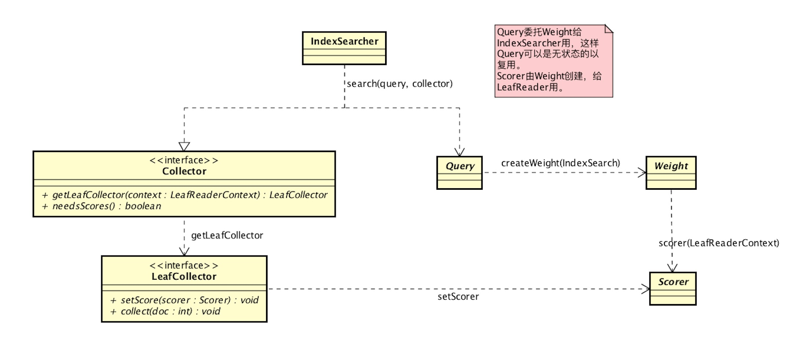
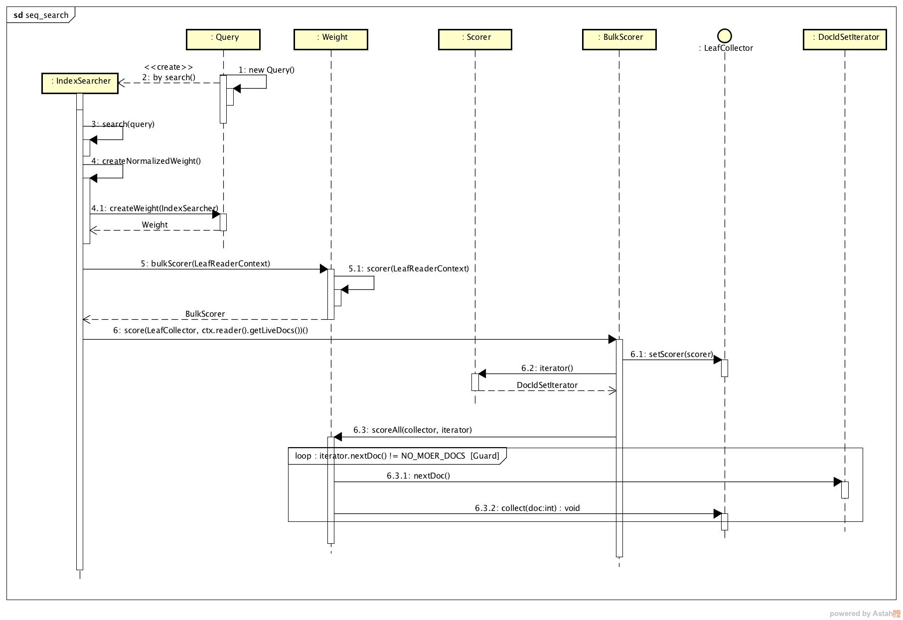

# 查询（Search）
Lucene中负责查询功能的代码都放在`org.apache.lucene.search`包下。根据查询表达式得到我们想要的查询结果，这是检索系统最终的需求，比如大家用google就是主要操作查询。

## 查询主要模块（接口，类关系）
主要构件组成图如下：

## search方法主要流程（类方法交互调用）

## 一些详细过程分析
整个查询模块有几个核心构件组成，IndexSearch是总体入口，直接对外提供各种search api方法。内部通过 Query， Weight，Scorer。这种设计把整个查询的主工作流程抽象出来统一，然后每个具体的查询逻辑只要扩展相应的Query，Weight就可以了。
