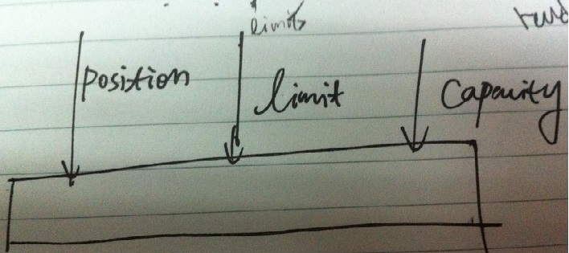

# ChannelBufferFactory体系

netty中ChannelBufferFactory的用于提供统一工厂接口来构造 `ChannelBuffer`, 主要有两种实现,基于`系统底层直接分配内存`的实现类`HeapChannelBufferFactory`和基于`JVM的堆内存`的实现类`DirectChannelBufferFactory`.

`HeapChannelBufferFactory`就不用说了,它直接通过JVM来分配,管理内存. `DirectChannelBufferFactory`直接操作本地系统分配,管理内存.但是它做了一个很大的优化,就是针对JVM对低层操作的内存是通过`ReferenceQueue`来实现回收的,但是我们知道这种实现肯定是效率比较低的.所以它会直接分配一整块较大连续空间的内存用于后续频繁的内存分配请求,这样就相当于把减少了JVM和底层系统的交互,从而提高效率和吞吐量.请下下面示图:

#ChannelBuffer体系

## `ChannelBuffer`和`java.nio.Buffer`的区别

我们知道`java.nio.Buffer`中最关键的有三个`指针`字段,`position`,`limit`,`capacity`,分别用来表示当前指针位置, 最大指针移动位置, 及buffer容量. 他们必需满足: 0 <= position <= limit <= capacity

当对buffer进行写操作时,position向前移动,但不能超过limit.进行写的操作后,如果要从buffer读取数据怎么办呢?也还是从position位置读取数据并向前移动,但是在执行这个读操作前,必需把position=1和limit=positon这两步操作,没办法,因为对buffer的读写操作都要用共享用到这三个字段,所以只能在每次操作前都要预置好这些值.
netty中`ChannelBuffer`重新定义了Buffer的操作方式,其原因之一就是解决上述的那个不断变换`position`,`limit`值的问题

## `ChannelBuffer` 的架构体系

请补充图
