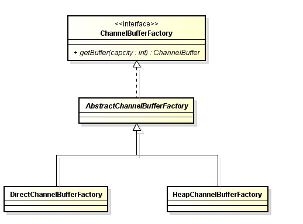
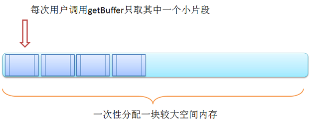

# ChannelBufferFactory体系

netty中ChannelBufferFactory的用于提供统一工厂接口来构造 `ChannelBuffer`, 主要有两种实现,基于`系统底层直接分配内存`的实现类`HeapChannelBufferFactory`和基于`JVM的堆内存`的实现类`DirectChannelBufferFactory`.

`HeapChannelBufferFactory`就不用说了,它直接通过JVM来分配,管理内存. `DirectChannelBufferFactory`直接操作本地系统分配,管理内存.但是它做了一个很大的优化,就是针对JVM对低层操作的内存是通过`ReferenceQueue`来实现回收的,但是我们知道这种实现肯定是效率比较低的.所以它会直接分配一整块较大连续空间的内存用于后续频繁的内存分配请求,这样就相当于把减少了JVM和底层系统的交互,从而提高效率和吞吐量.请下下面示图:

#ChannelBuffer体系